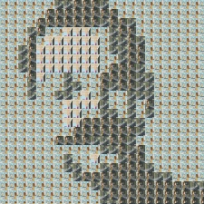
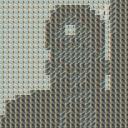
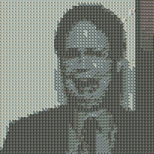

# Photoception

## Description

Photoception is a program that is suppose to generate photos out of artifacts.
Artifacts could be other photos or even videos. 

## Convert from a video

Photoception allows to convert a video into a photo by:
- 1. Fetching frames from a video
- 2. Converting the input photo to a photo with frames of the video


The conversion process is timed to know exactly how much time it takes:
```
Creating image out of map
  [##################------------------]   52%  00:01:29
```

### Example 1

From a rick & morty small youtube video:





### Example 2

You can refine more and more to look like the original by adding more frames 
and also by having a smaller factor (i.e., size of frames).
From a rick & morty small youtube video:




